# Athena Build Dependency Graph

> AUTO-GENERATED — run `make graph` or `python athena/scripts/generate_dependency_graph.py`

## Package Dependencies

| Package | Depends on |
|---------|------------|
| `athena-ai` | `athena-core`, `athena-sdk` |
| `athena-brokers` | `athena-os`, `athena-common`, `athena-core` |
| `athena-cli` | `athena-core`, `athena-sdk`, `athena-ai` |
| `athena-common` | — |
| `athena-core` | `athena-os`, `athena-common` |
| `athena-core-engine` | `athena-os`, `athena-common`, `athena-core` |
| `athena-core-events` | `athena-os`, `athena-common`, `athena-core` |
| `athena-core-metadata` | `athena-os`, `athena-common`, `athena-core` |
| `athena-core-runtime` | `athena-os`, `athena-common`, `athena-core` |
| `athena-dashboard` | `athena-core`, `athena-sdk` |
| `athena-data` | `athena-os`, `athena-common`, `athena-core` |
| `athena-domain` | `athena-common`, `athena-os` |
| `athena-execution` | `athena-os`, `athena-common`, `athena-core` |
| `athena-indicators` | `athena-os`, `athena-common`, `athena-core` |
| `athena-market` | `athena-os`, `athena-common`, `athena-core` |
| `athena-math` | `athena-os`, `athena-common`, `athena-core` |
| `athena-metadata` | `athena-os`, `athena-common`, `athena-core` |
| `athena-observability` | `athena-os`, `athena-common`, `athena-core` |
| `athena-os` | — |
| `athena-patterns` | `athena-os`, `athena-common`, `athena-core` |
| `athena-platform` | `athena-os`, `athena-common`, `athena-core`, `athena-domain`, `athena-data`, `athena-indicators`, `athena-patterns`, `athena-strategies`, `athena-risk`, `athena-portfolio`, `athena-execution` |
| `athena-portfolio` | `athena-os`, `athena-common`, `athena-core` |
| `athena-research` | `athena-os`, `athena-common`, `athena-core` |
| `athena-risk` | `athena-os`, `athena-common`, `athena-core` |
| `athena-sdk` | `athena-core` |
| `athena-strategies` | `athena-os`, `athena-common`, `athena-core` |
| `athena-testing` | `athena-os`, `athena-core`, `athena-common` |

## Mermaid

```mermaid
flowchart BT
    athena_core --> athena_ai
    athena_sdk --> athena_ai
    athena_os --> athena_brokers
    athena_common --> athena_brokers
    athena_core --> athena_brokers
    athena_core --> athena_cli
    athena_sdk --> athena_cli
    athena_ai --> athena_cli
    athena_os --> athena_core
    athena_common --> athena_core
    athena_os --> athena_core_engine
    athena_common --> athena_core_engine
    athena_core --> athena_core_engine
    athena_os --> athena_core_events
    athena_common --> athena_core_events
    athena_core --> athena_core_events
    athena_os --> athena_core_metadata
    athena_common --> athena_core_metadata
    athena_core --> athena_core_metadata
    athena_os --> athena_core_runtime
    athena_common --> athena_core_runtime
    athena_core --> athena_core_runtime
    athena_core --> athena_dashboard
    athena_sdk --> athena_dashboard
    athena_os --> athena_data
    athena_common --> athena_data
    athena_core --> athena_data
    athena_common --> athena_domain
    athena_os --> athena_domain
    athena_os --> athena_execution
    athena_common --> athena_execution
    athena_core --> athena_execution
    athena_os --> athena_indicators
    athena_common --> athena_indicators
    athena_core --> athena_indicators
    athena_os --> athena_market
    athena_common --> athena_market
    athena_core --> athena_market
    athena_os --> athena_math
    athena_common --> athena_math
    athena_core --> athena_math
    athena_os --> athena_metadata
    athena_common --> athena_metadata
    athena_core --> athena_metadata
    athena_os --> athena_observability
    athena_common --> athena_observability
    athena_core --> athena_observability
    athena_os --> athena_patterns
    athena_common --> athena_patterns
    athena_core --> athena_patterns
    athena_os --> athena_platform
    athena_common --> athena_platform
    athena_core --> athena_platform
    athena_domain --> athena_platform
    athena_data --> athena_platform
    athena_indicators --> athena_platform
    athena_patterns --> athena_platform
    athena_strategies --> athena_platform
    athena_risk --> athena_platform
    athena_portfolio --> athena_platform
    athena_execution --> athena_platform
    athena_os --> athena_portfolio
    athena_common --> athena_portfolio
    athena_core --> athena_portfolio
    athena_os --> athena_research
    athena_common --> athena_research
    athena_core --> athena_research
    athena_os --> athena_risk
    athena_common --> athena_risk
    athena_core --> athena_risk
    athena_core --> athena_sdk
    athena_os --> athena_strategies
    athena_common --> athena_strategies
    athena_core --> athena_strategies
    athena_os --> athena_testing
    athena_core --> athena_testing
    athena_common --> athena_testing
```

