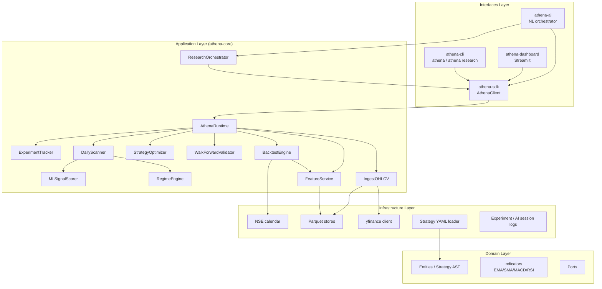

# Athena Platform — Complete

**Validated by:** Final Master Orchestrator Agent  
**Date:** 2026-06-27  
**Repository:** StockMarketModel (`athena/` monorepo)  
**Baseline commit:** Phase 6 `da280e6` → Platform 1.0.0

---

## Executive Summary

The Athena Quantitative Research Operating System MVP is **complete**. All phases (0–6) deliverables are implemented, tested, documented, and CI-gated. The platform supports the full research loop: ingest → feature store → backtest → walk-forward → optimize → scan → explain → compare → AI-assisted research → dashboard visualization.

---

## Phase Checklist (0–6)

| Phase | Focus | Status | Validation |
|-------|-------|--------|------------|
| **0** | Monorepo scaffold, ATH specs, REQ backlog | ✅ | [PHASE-0-VALIDATION.md](PHASE-0-VALIDATION.md) |
| **1** | Data ingest, NSE calendar, EMA/SMA, feature store | ✅ | [PHASE-1-VALIDATION.md](PHASE-1-VALIDATION.md) |
| **2** | Strategy YAML, backtest engine, experiment tracking | ✅ | [PHASE-2-VALIDATION.md](PHASE-2-VALIDATION.md) |
| **3** | Regime, scanner, walk-forward, experiment compare | ✅ | [PHASE-3-VALIDATION.md](PHASE-3-VALIDATION.md) |
| **4** | Optimizer, ML scorer, SHAP explainability | ✅ | [PHASE-4-VALIDATION.md](PHASE-4-VALIDATION.md) |
| **5** | Polished CLI, SDK, Streamlit dashboard | ✅ | [PHASE-5-VALIDATION.md](PHASE-5-VALIDATION.md) |
| **6** | AI research assistant (`athena-ai`) | ✅ | [PHASE-6-VALIDATION.md](PHASE-6-VALIDATION.md) |
| **7** | CI, install scripts, model persistence, Optuna, sign-off | ✅ | This document |

---

## REQ Implementation Status

| REQ ID | Title | Phase | Status |
|--------|-------|-------|--------|
| REQ-DATA-INGEST-001 | yfinance → Parquet ingest | 1 | ✅ Implemented |
| REQ-DATA-CALENDAR-001 | NSE trading calendar | 1 | ✅ Implemented |
| REQ-IND-EMA-001 | EMA indicator | 1 | ✅ Implemented |
| REQ-IND-SMA-001 | SMA indicator | 1 | ✅ Implemented |
| REQ-FEAT-STORE-001 | Parquet feature store | 1 | ✅ Implemented |
| REQ-STRAT-CONFIG-001 | YAML strategy configuration | 2 | ✅ Implemented |
| REQ-BT-ENGINE-001 | Walk-forward backtest engine | 2 | ✅ Implemented |
| REQ-EXP-TRACK-001 | Experiment tracking | 2 | ✅ Implemented |
| REQ-REGIME-001 | Market regime classification | 3 | ✅ Implemented |
| REQ-SCANNER-001 | Daily universe scanner | 3 | ✅ Implemented |
| REQ-WALK-FORWARD-001 | Walk-forward validation framework | 3 | ✅ Implemented |
| REQ-EXP-COMPARE-001 | Experiment comparison | 3 | ✅ Implemented |
| REQ-OPT-001 | Strategy parameter optimizer | 4 | ✅ Implemented (+ Optuna TPE) |
| REQ-ML-SCORER-001 | ML signal scorer | 4 | ✅ Implemented (+ model persistence) |
| REQ-EXPLAIN-001 | SHAP explainability | 4 | ✅ Implemented |
| REQ-CLI-001 | Polished Athena CLI | 5 | ✅ Implemented |
| REQ-SDK-001 | Python SDK (`AthenaClient`) | 5 | ✅ Implemented |
| REQ-DASH-001 | Streamlit dashboard MVP | 5 | ✅ Implemented |
| REQ-AI-ASSISTANT-001 | AI research assistant | 6 | ✅ Implemented |
| REQ-DATA-QUALITY-001 | OHLCV data quality checks | Ref Pkg 03 | ✅ Implemented |
| REQ-IND-MACD-001 | MACD indicator | Ref Pkg 05 | ✅ Implemented |
| REQ-IND-RSI-001 | RSI indicator | Ref Pkg 05 | ✅ Implemented |

**Total:** 22 / 22 REQ specs implemented.

---

## References Package Integration (01–15)

All References packages integrated into `athena/athena-spec/` — see [REFERENCES-INTEGRATION-COMPLETE.md](REFERENCES-INTEGRATION-COMPLETE.md).

| Packages | Key deliverables |
|----------|------------------|
| 01–02 | Governance, architecture, contracts, PluginRegistry |
| 03–06 | Data platform, market intelligence, indicators (MACD/RSI), pattern stub |
| 07–11 | Strategy, backtest, portfolio, research, statistics specs |
| 12–14 | ML lifecycle, AI research scientist, platform ops |
| 15 | Handbook → `athena-docs/handbook/` |

---

## Architecture



---

## Quick Start (Full Platform)

### 1. Install

**Windows (PowerShell):**

```powershell
.\athena\scripts\install.ps1
.\athena\athena-core\.venv\Scripts\Activate.ps1
```

**Unix / macOS:**

```bash
bash athena/scripts/install.sh
source athena/athena-core/.venv/bin/activate
```

**Manual:**

```bash
cd athena/athena-core
python -m venv .venv
.venv/Scripts/pip install -e ".[dev]"
.venv/Scripts/pip install -e "../athena-sdk[dev]" -e "../athena-ai[dev]" -e "../athena-cli[dev]" -e "../athena-dashboard[dev]"
```

### 2. Verify

```bash
athena health
athena-ai "optimize ema parameters" --dry-run
```

### 3. Ingest data

```bash
athena ingest RELIANCE.NS --start 2023-01-01 --end 2024-12-31 \
  --config athena/athena-examples/config/ingest.yaml
```

### 4. Backtest

```bash
athena backtest --strategy athena/athena-examples/config/ema_crossover.yaml \
  --config athena/athena-examples/config/backtest.yaml --track-experiment
```

### 5. Walk-forward validate

```bash
athena walk-forward --strategy athena/athena-examples/config/ema_crossover.yaml \
  --start 2022-01-01 --end 2024-06-01 \
  --config athena/athena-examples/config/backtest.yaml
```

### 6. Optimize parameters

```bash
athena optimize --strategy athena/athena-examples/config/ema_crossover.yaml \
  --start 2022-01-01 --end 2024-06-01 \
  --config athena/athena-examples/config/backtest.yaml
```

### 7. Daily scan

```bash
athena scan --strategy athena/athena-examples/config/ema_crossover.yaml \
  --as-of 2024-06-01 \
  --symbols-file athena/athena-examples/symbols/nifty500_sample.csv \
  --config athena/athena-examples/config/backtest.yaml --output scan.json
```

### 8. Compare experiments

```bash
athena compare-experiments --latest 5 \
  --config athena/athena-examples/config/backtest.yaml --output-format table
```

### 9. AI research

```bash
athena research "Find the best EMA strategy for sideways markets" \
  --config athena/athena-examples/config/backtest.yaml --dry-run
```

### 10. Dashboard

```bash
athena-dashboard
```

Upload `scan.json` on the Import page for offline viewing.

---

## Testing

```bash
# Default: unit tests only (integration excluded)
cd athena/athena-core && python -m pytest -q

# Full monorepo
cd athena/athena-core && python -m pytest -q
cd ../athena-sdk && python -m pytest -q
cd ../athena-ai && python -m pytest -q
cd ../athena-cli && python -m pytest -q
cd ../athena-dashboard && python -m pytest -q
```

### Integration test marker

Live network tests (yfinance) are marked `@pytest.mark.integration` and **excluded by default** via `addopts = "-m 'not integration'"` in `athena-core/pyproject.toml`.

Run integration tests explicitly:

```bash
cd athena/athena-core
python -m pytest -m integration -v
```

---

## CI

GitHub Actions workflow `.github/workflows/ci.yml` runs on push/PR to `master`/`main`:

- Python 3.11 and 3.12 matrix
- Editable install of all workspace packages
- Full pytest suite (unit tests)
- Ruff lint on athena-core

---

## Known Limitations (Honest)

| Area | Limitation |
|------|------------|
| **Market data** | yfinance MVP; no corporate-action adjustment; static NSE holiday YAML |
| **Universe** | NIFTY 500 sample CSV for dev; full-universe performance depends on ingested Parquet |
| **Backtest fills** | Close-of-bar with slippage; no open-to-close or intraday |
| **Short selling** | Not supported |
| **Walk-forward** | Test-window evaluation; in-fold parameter fitting via optimizer only |
| **ML scorer** | Trains on strategy signals; requires sufficient labeled samples |
| **SHAP** | LinearExplainer deprecation warnings on sklearn ≥1.4; functional |
| **AI assistant** | Rule-based NL parser by default; OpenAI optional via `OPENAI_API_KEY` |
| **Production** | No live trading, broker integration, or production deployment stack |
| **License** | MIT intended; formal LICENSE file pending |

---

## Production Readiness Notes

**Ready for research use:**

- Reproducible backtests with experiment tracking and git commit capture
- Config-driven strategies (YAML + Pydantic validation)
- Walk-forward and optimizer workflows with multi-objective scoring
- CI-gated test suite across Python 3.11/3.12

**Not production-trading ready:**

- No order management, risk limits at broker level, or real-time feeds
- No secrets management, auth, or multi-tenant deployment
- Dashboard is Streamlit MVP (local/single-user)
- Data pipeline requires manual holiday YAML maintenance

**Recommended before live capital:**

1. Independent data vendor with corporate-action adjustment
2. Paper trading integration and slippage calibration
3. Formal LICENSE and security review
4. Extended integration tests on full NIFTY 500 universe

---

## Documentation Index

| Document | Purpose |
|----------|---------|
| [ATH-000 Philosophy](ATH-000-Philosophy.md) | Mission and principles |
| [ATH-001 Vision & PRD](ATH-001-Vision-PRD.md) | Product vision |
| [ATH-002 Engineering Standards](ATH-002-Engineering-Standards.md) | Code quality |
| [ATH-003 Repository Architecture](ATH-003-Repository-Architecture.md) | Monorepo layout |
| [requirements/](requirements/) | REQ backlog (19 specs) |
| [PHASE-0 … PHASE-6](PHASE-0-VALIDATION.md) | Phase validation reports |
| [Root README](../../README.md) | Quick start |
| [CHANGELOG](../../CHANGELOG.md) | Release history |

Legacy spec copy: [`Documents/`](../../Documents/README.md) → prefer `athena/athena-spec/`.

---

## Platform Status

**COMPLETE** — All phases 0–6 implemented; Phase 7 polish (CI, install, persistence, Optuna, sign-off) delivered. Ready for quantitative research workflows on Indian equities (NSE / NIFTY 500, daily OHLCV).
